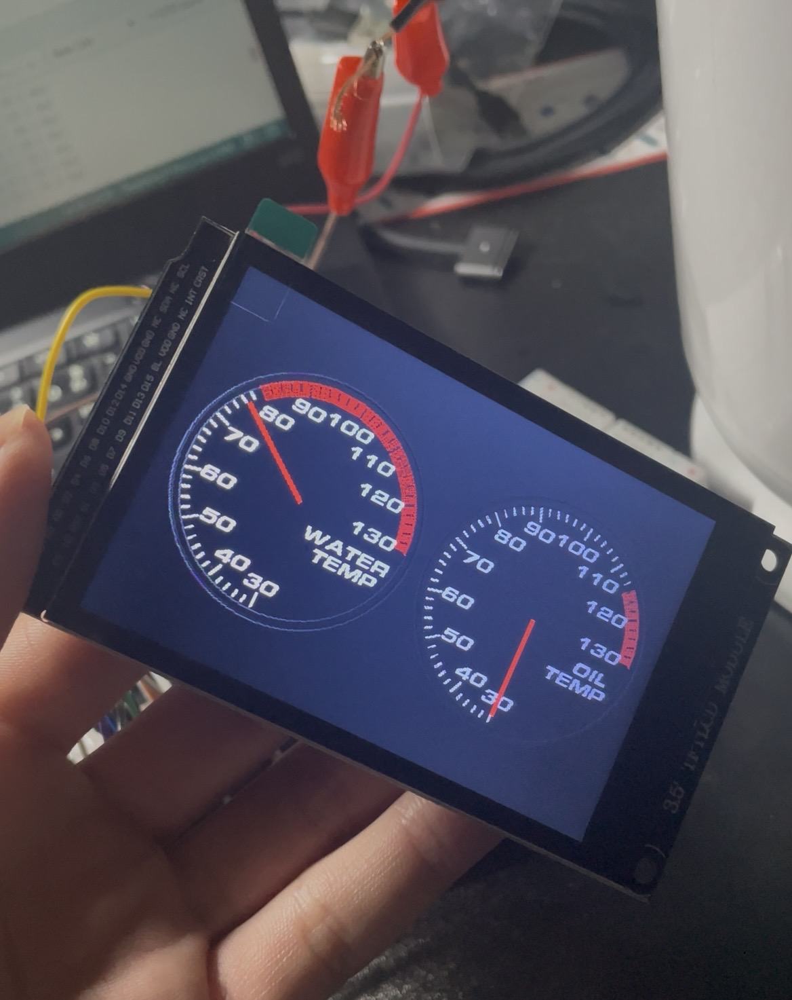
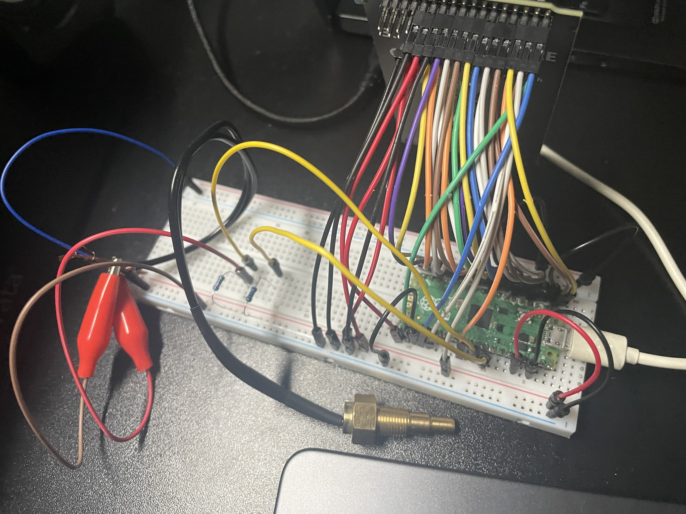

# car-oil-water-temp-indicator

A DIY add-on gauge for cars that displays **oil temperature** and **water (coolant) temperature**. Built with a Raspberry Pi Pico (RP2040) and a 3.5-inch ILI9486 display, it renders two analog-style gauges — **WATER TEMP** and **OIL TEMP** — side by side.

## Gallery

### Display



### Wiring (breadboard prototype)



## Features

- **Dual analog gauges** — water temperature (left) and oil temperature (right) on a single screen
- **Startup animation** — the needles sweep once on power-up (about 4.4 s)
- **Red-zone warning** — the outer ring flashes red when the temperature exceeds the configured limit (default 115 °C)
- **Buzzer alarm** — intermittent beep in the warning zone, continuous tone above the upper limit (130 °C)
- **Smoothing filter** — a first-order filter (`FILTER_BETA = 0.05`) on the ADC values and needle angle suppresses flicker
- **Dual-core operation** — core 0 reads sensors and manages state, core 1 handles drawing (`setup1` / `loop1`)

## Hardware

| Part | Details |
| --- | --- |
| MCU | Raspberry Pi Pico (RP2040) |
| Display | 3.5-inch ILI9486 SPI LCD (480×320, 85.5 × 55.6 mm) |
| Temperature sensors | 2× thermistor (water / oil), voltage-divided with a 10 kΩ series resistor |
| Alarm | Passive / active buzzer |

### Thermistor constants (as used in the code)

`updateSensorData()` uses a Steinhart–Hart approximation that assumes the following. Adjust these to match the thermistor you actually use.

- Series resistor: 10 kΩ
- Reference resistance R0: 11 kΩ (at 20 °C)
- B constant: 3500

## Pin assignment

The pins defined in the sketch (GPIO numbers):

| Function | Pin | Constant |
| --- | --- | --- |
| Water temp sensor (ADC0) | GPIO 26 | `SENSOR_WATER` |
| Oil temp sensor (ADC1) | GPIO 27 | `SENSOR_OIL` |
| Toggle switch | GPIO 28 | `SW_PIN` |
| Buzzer | GPIO 20 | `BUZZER_PIN` |
| LCD backlight | GPIO 16 | `TFT_BL` |

> The display's SPI pins (MOSI / SCK / CS / DC / RST, etc.) are configured on the **TFT_eSPI `User_Setup.h`** side. ILI9486 RPi LCD terminals: +5V / GND / DC / RST / CS / MOSI / SCK / MISO / T_CS (tie T_CS to 3.3 V when touch is unused).

## Required library

- [TFT_eSPI](https://github.com/Bodmer/TFT_eSPI) — ILI9486 driver and sprite rendering

In `User_Setup.h` (or `User_Setup_Select.h`), enable the **ILI9486 driver**, the resolution, and the Pico SPI pins. The custom font `eurostile_extd_black_italic8pt7b.h` (included) is used for the gauge labels.

## Build & flash (Arduino IDE)

1. Add the **Raspberry Pi Pico / RP2040** board package (earlephilhower core) to the Arduino IDE
2. Install the TFT_eSPI library and configure `User_Setup` for ILI9486 + Pico
3. Select the "Raspberry Pi Pico" board and the correct port
4. Open `indicator_test.ino` and upload

## File structure

```
indicator_test/
├── indicator_test.ino                  # Main sketch (dual-core)
├── eurostile_extd_black_italic8pt7b.h   # Custom display font (8 pt)
├── eurostile_extd_black_italic10pt7b.h  # Custom display font (10 pt)
├── docs/                                # Images used in this README
└── README.md
```

## Key settings (editable at the top of the sketch)

| Constant | Default | Description |
| --- | --- | --- |
| `WATER_REDZONE_TEMP` | 115.0 | Water-temp red-zone start [°C] |
| `OIL_REDZONE_TEMP` | 115.0 | Oil-temp red-zone start [°C] |
| `MAX_GAUGE_TEMP` | 130.0 | Gauge maximum / continuous-alarm temperature [°C] |
| `FILTER_BETA` | 0.05 | Smoothing-filter coefficient (smaller = smoother) |
| `CENTER_X` / `CENTER_X2` | 114 / 356 | Center X of the left / right gauge |

## References

- [Measuring temperature with a TMP36 and showing it on an LCD — IoT basics (JP)](https://iot.keicode.com/arduino/temperature-tmp36.php)
- [Building a car gauge with a Raspberry Pi — Qiita (JP)](https://qiita.com/ototo/items/ddeff02151890e2f6046)
- [File to C style array converter](https://notisrac.github.io/FileToCArray/) (image → C array: RGB565 / big-endian / uint16_t)
- Reference sizes for commercial add-on gauges: φ52 / φ60 mm; Defi advance ZD display 51.8 × 26.7 mm

## Notes

During development, a MicroPython custom module for drawing JPEGs to the ILI9486 on the Pico (`ili9486_jpg_display`) was also explored, but the final form in this repository is the **Arduino + TFT_eSPI** sprite-rendering version.
